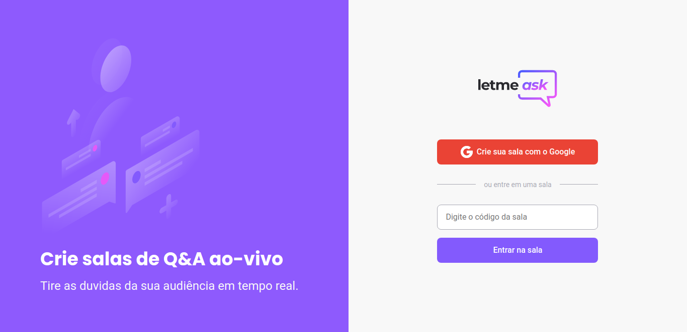

</p>
<h1 align="center">
    
</h1>

<h4 align="center"> 
	Letmeask
</h4>

<p align="center">
 <a href="#-sobre-o-projeto">Sobre</a> •
 <a href="#-funcionalidades">Funcionalidades</a> •
 <a href="#-como-executar-o-projeto">Como executar</a> • 
 <a href="#-tecnologias">Tecnologias</a> • 
 <a href="#-autor">Autor</a> • 
 <a href="#user-content--licença">Licença</a>
</p>


## 💻 Sobre o projeto

 Letmeask - é uma aplicação para que os streamers abrir salas para seus usuários poderem tirar duvidas.


Projeto desenvolvido durante a **NLW - Next Level Week** oferecida pela [Rocketseat](https://blog.rocketseat.com.br/primeira-next-level-week/).
O NLW é uma experiência online com muito conteúdo prático, desafios e hacks onde o conteúdo fica disponível durante uma semana.


## 📚 Atividades realizadas

1º dia
- [x] Configuração de ambiente de desenvolvimento
- [x] Configurações iniciais do Firebase

2º dia
- [x] Autenticação de usuarios
- [x] Criação de sala
- [x] Roteamento e navegação

3º dia
- [x] Criação de sala
- [x] Controller de usuarios
- [x] Respondendo e criando perguntas
- [x] Crindo hook useRom

4º dia
- [x] Entrutura de perguntas
- [x] Hook useRoom
- [x] Funcionalidade de like
- [x] Controle de sala (admin)
- [x] Controle de perguntas

5º dia
- [x] Destaque de perguntas respondidas
- [x] Marca pergunta respondida
- [x] Hospedando projeto

Bônus
- [ ] Tema dark
- [ ] Responsividade
- [ ] Versão PWA
- [ ] Outro banco de dados

### Web

<p align="center" style="display: flex; align-items: flex-start; justify-content: center;">
  

</p>

---

## 🚀 Como executar o projeto
### Pré-requisitos

Antes de começar, você vai precisar ter instalado em sua máquina as seguintes ferramentas:
[Git](https://git-scm.com), [Node.js](https://nodejs.org/en/). 
Além disto é bom ter um editor para trabalhar com o código como [VSCode](https://code.visualstudio.com/)

#### 🧭 Rodando a aplicação web (Frontend)

```bash

# Clone este repositório
$ git clone git@github.com:lucasfernandodev/letmeask.git

# Acesse a pasta do projeto no seu terminal/cmd
$ cd letmeask

# Instale as dependências
$ yarn install
# ou npm install

# Execute a aplicação em modo de desenvolvimento
$ yarn start
# ou npm run start

# A aplicação será aberta na porta:3000 - acesse http://localhost:3000

```

---

## 🛠 Tecnologias

As seguintes ferramentas foram usadas na construção do projeto:

#### **Website**  ([React](https://reactjs.org/)  +  [TypeScript](https://www.typescriptlang.org/))

-   **[React Router Dom](https://github.com/ReactTraining/react-router/tree/master/packages/react-router-dom)**

> Veja o arquivo  [package.json](./package.json)


---

## 🦸 Autor

<a href="https://lucasfernando.dev/">
 
 <br />
 <sub><b>Lucas Fernando</b></sub></a> <a href="https://lucasfernando.dev" title="Lucas Fernando">🚀</a>
 <br />

---

## 📝 Licença

Este projeto esta sobe a licença [MIT](./LICENSE).

Feito com 💜 por Lucas Fernando 👋 [Entre em contato!](https://www.linkedin.com/in/lucas-fernando-a19ab5213/)
